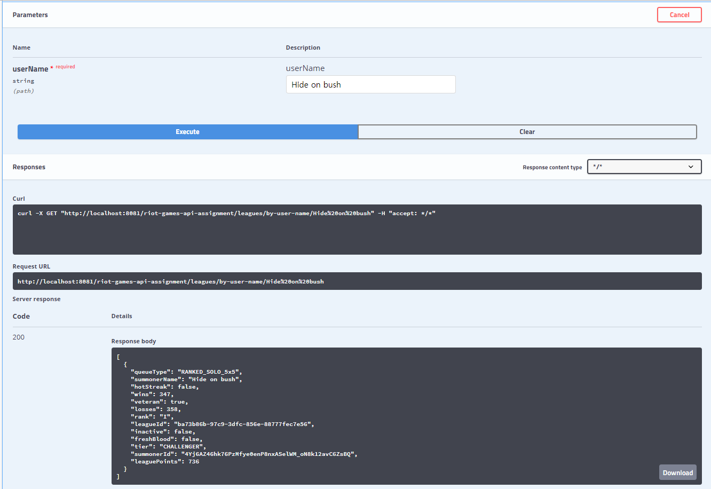

# Spring Boot Application Using Riot Games API
아주대학교 실전코딩 2조

이안규, 원동욱, 최진영, 최지원, 김도연 - 총 5명


## 개요
라이엇 게임즈의 롤 API를 이용하여, 소환사이름을 Parameter로 request 할수있는 GET방식의 endpoint(API)를 구현한 Application입니다.
이 API를 이용하여 소환사의 게임 리그 성적정보를 Response할 수 있습니다.

## 사용된 Dependencies & APIs
- Spring Framework
- Spring Fox Swagger - version 2.9.2
- Lombok - version 1.18.8
- [Riot Games API](<https://developer.riotgames.com/>)

## 사용 시 주의사항
### Api key를 확인

```java

@Service
public class RiotGamesApiClient {
    private final String apikey = "RGAPI-********-****-****-****-*********"; // <-자신의 Api key를 사용하세요.

```

이 Application을 사용하기 위해서는, Api Key를 꼭 확인하세요. Riot Games에서 제공하는 Development Api Key는 생성 시 24시간 이후에 만료가 되기 때문에,
24시간마다 갱신해줘야 합니다.

### Server Port를 확인
```properties
server.port = 8081
```
Application을 실행할 때, 사용하는 Server Port를 확인하고 원하시면 임의의 포트로 변경하세요. (resources/application.properties)

이 프로젝트에서는 `localhost:8081`을 통해 접속하실 수 있습니다


## 기능 설명
### API 사용 과정

```java

 @Scheduled(fixedDelay = 4000L)
    public void getRiotGamesApiPeriodically() {
        Summoner summoner = riotGamesApiClient.requestSummoner("hide on bush");
        League[] league = riotGamesApiClient.requestLeague(summoner.getId());
        riotGamesApiRepository.insertRiotGamesApi(league);
        log.info("riot games api has been inserted successfully. {}", league);
    }

```
이 Application에서는 4초마다 한번씩 Riot Gams API에 `hide on bush` 소환사의 정보를 가져오고, 소환사 개인의 EncryptedId를 이용하여 그 소환사의 리그 게임
성적 정보를 불러와, MongoDB에 데이터를 저장합니다.

### MongoDB 저장 쿼리

```java
Query query = Query.query((Criteria
.where("summonerName").is(league[i].getSummonerName()))
.and("queueType").is(league[i].getQueueType()));

```
`insertRiotGamesApi` Method를 통해 Api에서 받아온 데이터를 위의 쿼리문을 통해 MongoDB에 저장하게 됩니다.
여기서 `queueType`까지 비교하는 이유는, 롤에서 랭크 게임에는 크게 솔로 랭크와 팀 랭크로 나뉘어져 있기 때문에,
같은 소환사의 이름을 불러와 저장하려고 해도 기존에 저장되어있는 queueType이 다를 수 있기 때문입니다.
즉, 리그 정보가 여러개이므로, 데이터를 전달 받을 때 List형식으로 받도록 만들었습니다.

```java
if (mongoTemplate.findOne(query, League.class) == null) {
  mongoTemplate.insert(league[i]);
  }
  
  mongoTemplate.findAndReplace(query, league[i]);
```
이후, 위에서 작성한 쿼리문을 이용하여 DB에 데이터가 없다면, 새로 데이터를 Insert하게 됩니다.

그 외에 DB에 데이터가 이미 있다면, findAndReplace 메소드를 이용하여 데이터를 찾고 Update하는 방식으로 만들었습니다.


## GET Response
MongoDB에 성공적으로 저장이 되어있다면, `localhost:8081`을 통해 DB에 저장되어있는 정보를 GET할 수 있습니다.

```java
    @GetMapping("/riot-games-api-assignment/leagues/by-user-name/{userName}")
    public List<League> getLeague(@PathVariable String userName) {
        return riotGamesApiService.getLeagueInfo(userName);
    }
```

혹은 `http://localhost:8081//swagger-ui.html`을 통해 확인하실 수도 있습니다.


